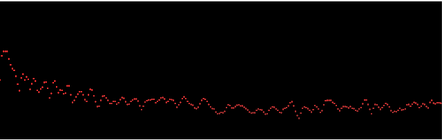

# Audio visualizer in Coffee script 

# Usage 
```html
<script type="text/javascript">
	$(document).ready(function(){
		var audiviz = new Audiviz(".visualizer", "myAudio");
		audiviz.run();
	})
</script>
```

## Bars style


## Dots style


# Install npm 

```
 curl https://npmjs.org/install.sh | sh
```

# Install dependencies

```
npm install
```

# Install and run http-server

```
 npm install http-server -g
```

```
http-server [path] [options]
```

## Sample

```
cd test
http-server .
```
