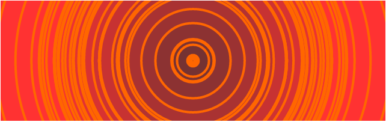

# Audio visualizer in Coffee script 

# Usage 


> $(audioPlayerElement).audiViz(canvasClass, style);


## Sample

```html
<audio id="player" src="gyako.mp3"></audio>
<canvas class="visualizer" width="640" height="200"></canvas>
...
<script type="text/javascript">
	$(document).ready(function(){
		$('#player').audiViz(".visualizer", "circle");
	})
</script>
```

## Bars style


## Dots style


## Circle style


# Install npm 

```
 curl https://npmjs.org/install.sh | sh
```

# Install dependencies

```
npm install
```

# Install and run http-server

```
 npm install http-server -g
```

```
http-server [path] [options]
```

## Sample

```
cd test
http-server .
```
